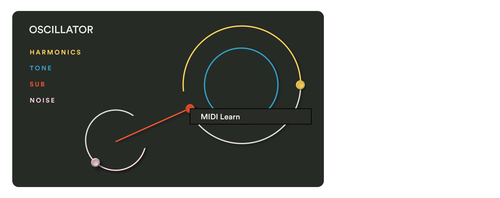

import { YouTube } from "astro-embed";

<YouTube id="CH_Ed7f7eQg" />

---

You can MIDI map all parameters in Cosmos within your DAW.

Simply right click the parameter you want to map and select "MIDI Learn".

