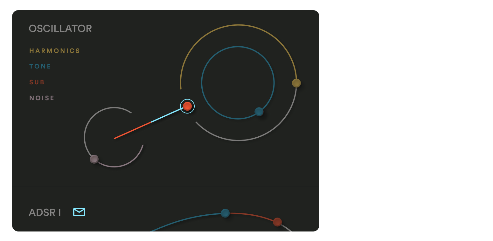
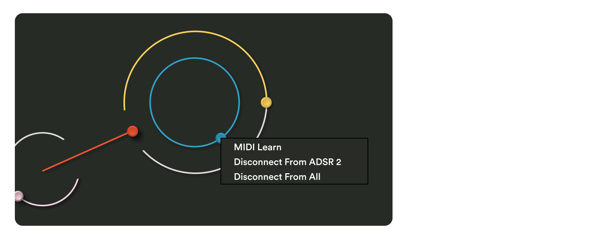

See this video to learn how to patch UFOs (frequency and shape) and Envelopes in Cosmos to help you create interesting sounds and sonic textures.

import { YouTube } from "astro-embed";

<YouTube id="Oe7pxqFFUCY" />

---

### Patching

Simply press an Envelope/UFO icon, then drag the parameter you want to affect. How far you drag the parameter affects the range of the modulation.

### Patch Overview

To see which parameters you've patched **hover** over one of the Envelope/UFO icons. The patches are color coded so you can easily see which parameters are being affected by what.

### Disconnecting a patch

To disconnect a patch simply right click on the parameter you want to disconnect and select **Disconnect From Envelope/UFO**.

If you want to disconnect all modulation for all parameters select **Disconnect From All**.

Similarly you can **right click the Envelope/UFO icons** to disconnect.

