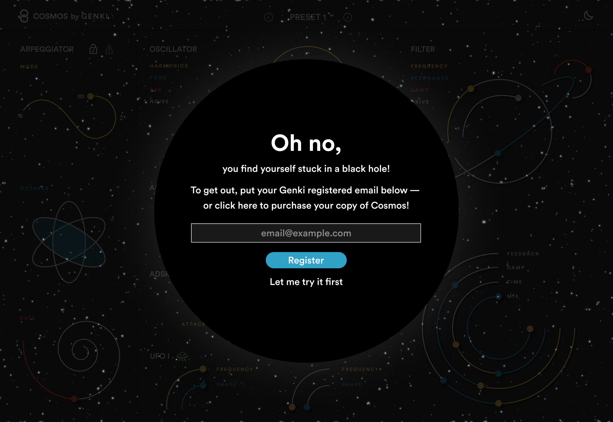

You can download a trial version of Cosmos before your purchase it!

To buy the full version, go to [genkiinstruments.com](https://genkiinstruments.com/products/cosmos)

import { LinkButton } from "@astrojs/starlight/components";

<LinkButton href="https://github.com/genkiinstruments/releases/releases/download/cosmos/Cosmos_mac.zip">
  Download for macOS
</LinkButton>
<LinkButton
  href="https://github.com/genkiinstruments/releases/releases/download/cosmos/Cosmos_win.zip"
  variant="secondary"
>
  {" "}
  Download for Windows{" "}
</LinkButton>

The Cosmos trial version stops working every 3 minutes. When it happens you have to open the plugin and press **Let me try it first** to get it working again.

