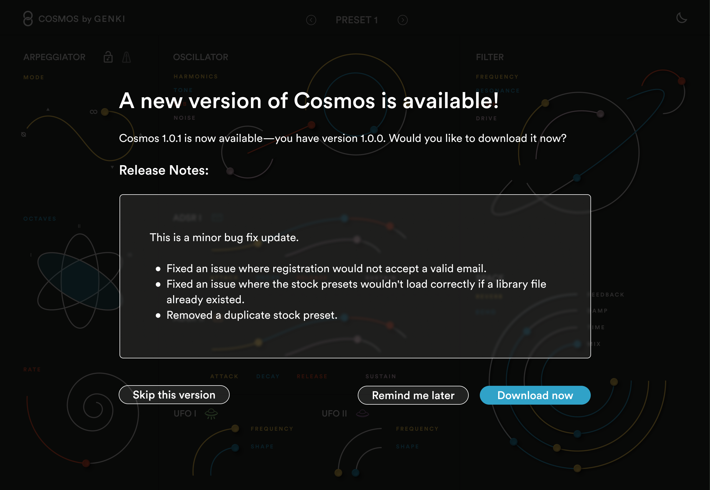
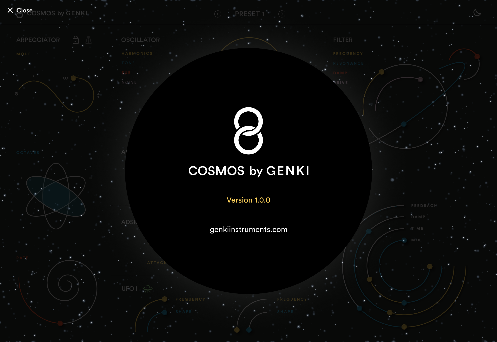

When a new update of Cosmos is out you'll get prompted with an update window.

You can download it by pressing **Download now**, skip the update by pressing **Skip this version** or get a reminder by pressing **Remind me later**.

If you want to see which version of Cosmos you have installed you can press the **Cosmos by Genki** logo in the top left corner.

