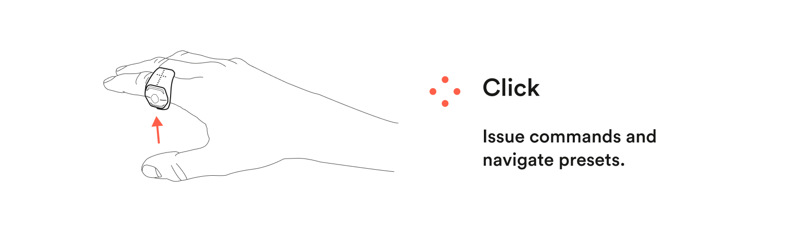
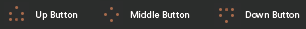
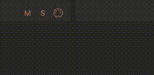

Click lets you use the buttons on Wave to send MIDI and Key commands to your DAW. Using the buttons on Wave to send commands opens up a lot of possibilities, for example you can use them to hit record, play and stop, to launch clips or to control switches in your plugins.

## Setting up a Click function

#### 1. Use the arrows to cycle between the buttons

Each button has an icon as shown below.

#### 2. Next select how the button behaves

There are 6 types of behaviors you can choose from

- Click Trigger
- Click Latching
- Long Press Trigger
- Long Press Latching
- Momentary
- Momentoggle

#### 3. Attach a CC value, a note, or a key command

- To attach a CC value or a note press the MIDI icon and select a number from the list
- To attach a key command press "key" and write the key command you want to use

## Click Behavior

You can choose between many types of behaviors for each button

#### Click

Click is when you press a button once to send a command.

Click allows you to choose between **Trigger** and **Latching.** A drop down menu is available in the bottom left corner of the Click function window when either Click or Long Press is chosen.

**Trigger**
Sends a short pulse with each click.

**Latching**
Toggles the output, like a toggle switch.

#### Long Press

Long Press is when you press a button and hold it to send a command. The command mapped to Long Press is activated after half a second

Long Press allows you to choose between **Trigger** and **Latching**. A drop down menu is available in the bottom left corner of the Click function window when either Click or Long Press is chosen.

**Trigger**
Sends a short pulse with each click.

**Latching**
Toggles the output, like a toggle switch.

#### Momentary

Momentary activates a command while you press the button down.

#### Momentoggle

Momentoggle is basically Click and Momentary combined. Clicking once toggles while holding the button down activates the momentary function.

## MIDI map Click: CC/Note

1. To map a Click to your DAW you need to tie a CC number or a Note to each function. Press the MIDI icon in the bottom right corner of the Click and select a CC number or Note of choice.
2. Solo the Click you want to map in order for Softwave to only send the signal for that particular function to your DAW.
3. When the parameter you want to map has been selected in your DAW toggle or hold the button for the MIDI message to register.

## Key commands / Shortcuts

Click can send Key Commands (Shortcuts) to your DAW.

1. Press "Key" in the lower right corner of the Click Function window.
2. Now use your computer keyboard to type in the key command you want to register.
3. For Key Commands to work the DAW window has to have focus.

First time you use Key Commands on an Apple computer Softwave will ask for permission to "control this computer using accessibility features". Enabling this is essential for key commands to work.

1. Press "Open system preferences".
2. Click the lock in the lower left corner of the System Preferences window.
3. Enable Softwave.
4. Lock again.

**If you've got a new version of Softwave you might need to do the above one more time.**

**Also Note that key commands do not work in Standalone mode - you need to have Softwave open for them to register.**

:::caution[Click functions may override default functionality]

Note that Click functions automatically override the button configuration actions set in settings.
:::
