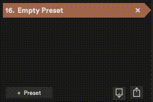
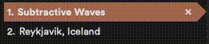
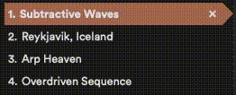

It's easy to create new presets, delete them, rename them or move them in order to customize your workflow to your needs.

## Creating new Preset

To create a new Preset click this icon.

## Renaming the Preset Bank

To rename the preset bank, click the **"Default Preset Bank".** You can now write in a new name. Press Enter when done or click with your mouse cursor outside the box

## Renaming Presets

There are two ways to rename presets.

1. To rename a preset in the preset list; click on the Preset name. You can now write a new name. Press Enter when done or click with the mouse cursor outside the box.

2. To rename a preset in the top left corner of the preset window; click the Preset name. You can now write a new name. Press Enter when done or click with the mouse cursor outside the box.

## Rearranging the Preset Bank

To rearrange Presets in your Preset Bank simply click and hold the preset number and drag it to the desired location.

## Deleting a Preset

To delete a Preset click the "x" behind the Preset in the Preset Bank list.

## Restoring a deleted Preset

If you accidentally delete a Preset and haven't saved your session you can use cmd+z (macOS) or ctrl+z (Windows) to undo your mistakes.

