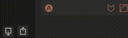

Softwave holds one Preset Bank at a time.
You can save and load preset banks so you can store multiple banks and even share them with others.

## Saving a Preset Bank

To save a Preset Bank click this icon.

## Loading Presets: Load new

To load a new Preset Bank click this icon and select "Load new". You can select a previously saved Preset Bank and load it into Softwave. This will swap the current bank out for the new one.

## Loading Presets: Add to bank

To add Presets into your Preset Bank click this icon and select "Add to bank". A window opens showing an overview of the previously saved Preset Bank. You can choose which of these presets you'll add to your current bank. Deselect the Presets you don't want to add and press "Ok".

