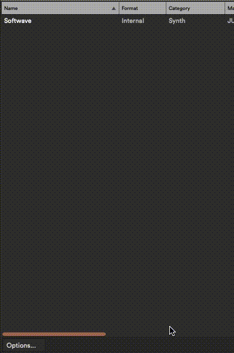
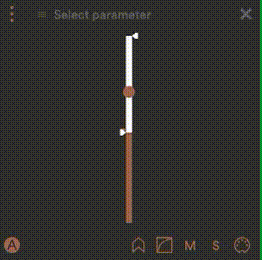
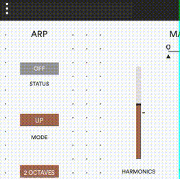

Each preset can host its own VST/VST3/AU plugin. This means you can use Softwave stand-alone without relying on an external DAW.

## Selecting a Plugin

To select a plugin click the box where it reads „Select plugin“. If the preset is already hosting a plugin the box will read the name of that particular Plugin.

## Scanning for available plugins

You need to scan for the plugins on your computer for Softwave to know which plugins are available. You can scan for VST3 and AU plugins.

1. To scan for your plugins navigate to the top left corner of your screen to Menu. Select "Scan for plugins". A window opens.
2. Press "Options..." and select "Scan for new or updated AudioUnit-or-VST3 plug-ins". This might take a while if you have a lot of plugins on your computer.
3. When the scanning process is over close the window.
4. All of your plugins should now be available in the "Select plugin" list within each Preset.

## Mapping function to plugin parameters

There are two options to map functions to plugin parameters.

### Dropdown menu

1. Press the "Select parameter" at the top of the function window you want to map.
2. A dropdown appears with all available parameters.
3. Select the one you want to map.
4. Repeat for other functions or if you want to remap an already mapped function.

### Moving your parameter

1. Open the plugin by pressing this icon.

2. At the top of each plugin you'll see the icons of all the functions within the preset. Press the icon of the function you want to map. It should turn brown.
3. Next move the parameter you want to map. The name of the parameter should appear next to the icon at the top. The parameter and function are mapped together.
4. Repeat for other functions or if you want to remap an already mapped function.

