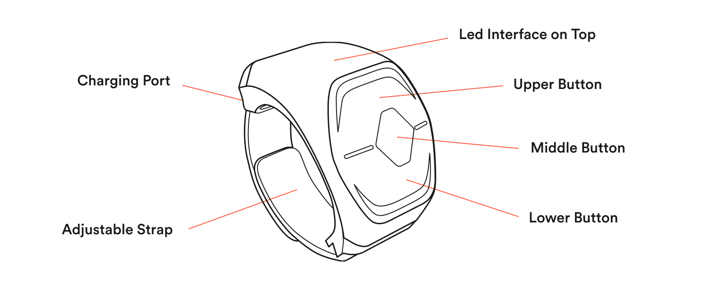

Wave is the ring that allows you to control sound with motion. Wave has three buttons, a LED display for visual feedback, micro USB charging port and an adjustable strap.

[ Download quickstart guide here. ](/quickstart-guides/wave-for-music.pdf)

