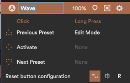
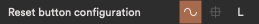

To access Wave's configuration panel press the gear-icon behind a connected Wave in the top left corner of Softwave. In the panel you can change Wave's name, Reset its movements, configure buttons and configure Wave's standalone mode.

## Rename Wave

To rename Wave right-click on a connected "Wave", select 'Rename' and type in a new name.

Renaming Wave can come in handy when you have more than one Wave, or if you simply want to identify your own Wave from the ones of your friends.

## Wave on Right or Left index finger

Depending on what you are doing it might come in handy to have Wave on your left index finger instead of the right one.

Wave is symmetrical so this is easily possible. In order to flip the screen as well as the motion detection algorithms press "R" (Right). It should now read "L" (Left). Repeat to change it back.

## Activate Wave from Softwave

Activating Wave from Softwave is made possible so one person can wear Wave and another one can control it.

Press this  icon.

## Reset Wave's movements from Softwave

Resetting Wave's movements from Softwave is made possible so one person can wear Wave and another one can control it.

Press this icon.

## Button configuration

You can configure all buttons to your liking, using either a Click or a Long Press (or both).

<table class="table table--color-header">
<thead>
<tr>
<th>Click</th>
<th>Long Press</th>
</tr>
</thead>
<tfoot>
<tr>
<td>A Click is when you press a button once to activate a command.</td>
<td>A Long Press is when you press a button down and hold it to activate a command. The command mapped to Hold is activated after half a second.</td>
</tr>
</tfoot>
</table>
## Reset Button Configuration
If you ever want to reset the button configuration to its default state press *Reset button configuration*.

If you want to undo the resetting of the buttons you can use the undo command, cmd+z (macOS) or ctrl+z (Windows).

## Icons

These icons identify which button you are configuring.

## Button Command List

Select a command from a drop down menu for each button;

1. Next Preset - Navigates to the next preset within Softwave.
2. Previous Preset - Navigates to the previous preset within Softwave.
3. Reset Movements - Resets movements to their starting point.
4. Edit Mode - Lets you enter Edit Mode (only in Standalone mode)
5. Activate - Activates and deactivates a Wave.
6. Momentary activate - Activates Wave while holding the button.
7. Show Battery - Shows the battery status of Wave.

## Standalone Mode editor

Standalone Mode is when you use Wave without Softwave.

To enter the Standalone Mode editor, press this icon. 

The changes you make are saved to Wave automatically.

## Wavefront editor

If you have the Wavefront receiver, you can edit how Wave behaves when connected to it.

To enter the Wavefront editor, press this icon. 

The changes you make are saved to Wave automatically.
