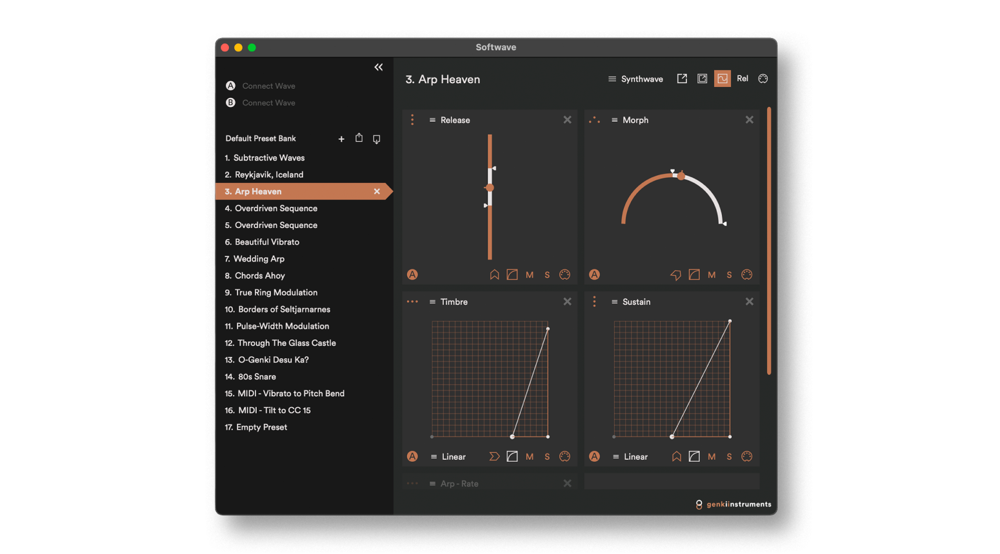

Softwave is Wave's software counterpart, allowing users to fully customize Wave by creating their own presets and preset banks. It can either help users intuitively map Wave's functions to their DAW of choice or host their favourite VST3 and AU plugins.

Softwave also has a built in sound engine and comes pre-loaded with fifteen curated presets so you can start making music immediately.

[ Download quickstart guide here](/quickstart-guides/softwave.pdf).

:::tip[When using Softwave.]

- When using Wave with your DAW keep Softwave open in the background.
- Softwave is not a VST plugin.
- Softwave does not work on your mobile.
  :::
