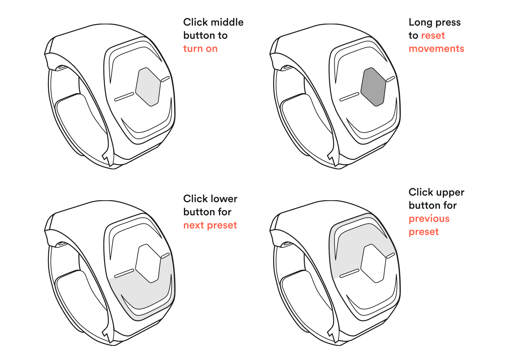

These are the default settings for Wave within Softwave.

These settings can be customized to your own liking in [Wave's configuration panel](/wave-for-music/settings/configuration-panel/).

Wave has 3 buttons; Up, Middle and Down. The Middle button activates and deactivates Wave.
Simply put you can deactivate Wave so you can scratch your nose without affecting sound every time you do it.

Holding the Middle button will Reset the movements to their starting point.

The Up and Down buttons act as navigation buttons. You use them to navigate between the presets in Softwave. Try navigating between presets while playing to change the sound in Softwave and functions on Wave.
