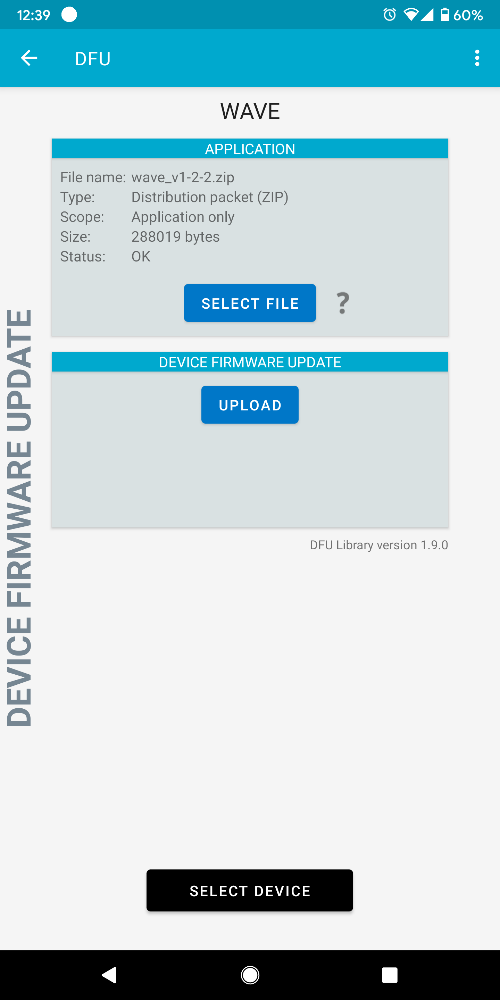

Keeping your Wave and Softwave up to date ensures you have the latest features, improvements, and bug fixes. This guide covers everything you need to know about firmware updates.

## Where to Find Latest Versions

### Latest Softwave Software

Download the newest version of Softwave from the [Obtaining Softwave](/wave-for-music/softwave-basics/obtaining/) page.

You can also find the latest releases here:

- **macOS:** [Softwave for macOS](https://github.com/genkiinstruments/releases/releases/download/softwave/Softwave_mac.zip)
- **Windows:** [Softwave for Windows](https://github.com/genkiinstruments/releases/releases/download/softwave/Softwave_win.exe)

### Latest Wave Firmware

The latest Wave firmware is available on GitHub:

- **Latest Firmware:** [Wave Firmware Downloads](https://github.com/genkiinstruments/releases/releases/tag/wave_firmware)

:::tip[Finding Firmware Versions]
When you visit the firmware page, you'll see different versions listed:

- Files ending with `_w_bl` include the bootloader (use only if specifically instructed)
- Files without `_w_bl` are standard application updates (use this for normal updates)
  :::

## Automatic Firmware Update (Recommended)

The easiest way to update your Wave firmware is through Softwave, which handles the process automatically.

### Steps for Automatic Update

1. **Ensure you have the latest Softwave** - Download and install the newest version from the links above
2. **Connect your Wave** - Turn on your Wave and connect it through Softwave
3. **Check for updates** - Softwave will automatically notify you if a firmware update is available
4. **Start the update** - Click to begin the firmware update process
5. **Wait for completion** - The update typically takes 2-5 minutes
   - Your Wave's LED will show update progress (white blinking light)
   - The progress bar in Softwave will advance from 0% to 100%
6. **Completion** - Wave will restart automatically when the update finishes

:::tip[During the Update]

- Keep your Wave close to your computer (within 1-2 meters)
- Don't turn off your Wave or close Softwave during the update
- Avoid using other Bluetooth devices nearby
  :::

## Troubleshooting Automatic Updates

### Update Stuck at 0%

If your Wave firmware update gets stuck at 0% for more than 5 minutes:

1. **Don't panic** - Your Wave is in update mode (indicated by the blinking white light)
2. **Wait 2 minutes** - Give the process time to timeout
3. **Close and restart Softwave** - Force quit if necessary
4. **Try the update again** - Reconnect your Wave and attempt the update once more

If the update fails again after a second attempt, proceed to the [Manual Update Methods](#manual-firmware-update) below.

### Update Fails Repeatedly

If Softwave cannot complete the firmware update after multiple attempts:

1. **Check Bluetooth connection**

   - Ensure your Wave is within close range (1-2 meters)
   - Check that no other devices are interfering with the Bluetooth connection
   - On macOS, try [clearing the Bluetooth cache](/general/troubleshooting/wave/#im-having-bluetooth-connection-issues)

2. **Verify Softwave version**

   - Make sure you have the latest version of Softwave installed
   - Older versions may not support newer firmware updates

3. **Try a different computer** (if available)

   - Sometimes Bluetooth hardware or drivers can cause issues

4. **Use manual update method**
   - If automatic updates continue to fail, use the manual methods below with your smartphone

### Wave Showing Blinking White Light

A blinking white light indicates your Wave is in DFU (Device Firmware Update) mode. This can happen if an update was interrupted:

**To exit DFU mode and return to normal operation:**

1. Leave the Wave alone for 2-3 minutes (it will automatically timeout)
2. Turn off your Wave by pressing and holding the button for 10 seconds
3. Turn it back on normally
4. Try connecting again in Softwave

**If Wave won't turn off:**

1. Let the battery drain completely (may take several hours)
2. Charge for at least 20 minutes
3. Turn on and try again

## Manual Firmware Update

If automatic updates through Softwave fail repeatedly, you can update manually using your smartphone.

### Manual Update - iOS

**What you'll need:**

- iOS device (iPhone or iPad)
- nRF Toolbox app
- Wave firmware file

**Steps:**

1. **Download the firmware**

   - On your iOS device, visit the [Wave firmware page](https://github.com/genkiinstruments/releases/releases/tag/wave_firmware)
   - Download the appropriate firmware file (choose the version without `_w_bl` unless instructed otherwise)
   - When prompted, select "Open in nRF Toolbox" or "Save to Files"

2. **Install nRF Toolbox** (if not already installed)

   - [Download nRF Toolbox from the App Store](https://apps.apple.com/app/nrf-toolbox/id820906058)

3. **Turn on your Wave**

   - Press and hold the button until you see lights
   - Wave should be in normal operating mode (not blinking white continuously)

4. **Open nRF Toolbox**

   - Tap "DFU" (Device Firmware Update)
   - Tap "Select File" and choose the firmware ZIP file you downloaded
   - Select the Wave device from the list of available Bluetooth devices

5. **Upload the firmware**

   - Tap "Upload" to begin the update
   - Wait for the progress to complete (usually 2-5 minutes)
   - Wave will restart automatically when finished

6. **Verify the update**
   - Reconnect Wave to Softwave on your computer
   - Check the firmware version to confirm the update succeeded

### Manual Update - Android

**What you'll need:**

- Android device
- nRF Toolbox app
- Wave firmware file

**Steps:**

1. **Download the firmware**

   - On your Android device, visit the [Wave firmware page](https://github.com/genkiinstruments/releases/releases/tag/wave_firmware)
   - Download the appropriate firmware file (choose the version without `_w_bl` unless instructed otherwise)
   - Note the download location (usually the Downloads folder)

2. **Install nRF Toolbox** (if not already installed)

   - [Download nRF Toolbox from Google Play](https://play.google.com/store/apps/details?id=no.nordicsemi.android.nrftoolbox)

3. **Turn on your Wave**

   - Press and hold the button until you see lights
   - Wave should be in normal operating mode (not blinking white continuously)

4. **Open nRF Toolbox**

   - Tap "DFU" (Device Firmware Update)

5. **Select the firmware file**

   - Tap "Select File" and browse to your downloaded firmware ZIP file
   - If prompted, select "Distribution packet (ZIP)"
   - Select "Application only" and press OK

6. **Select your Wave**

   - Tap "Select Device"
   - Look under "Available Devices" or "Bonded Devices"
   - Find and select your Wave from the list

7. **Upload the firmware**

   - Tap "Upload" to begin the update
   - Wait for the progress to complete (usually 2-5 minutes)
   - Wave will restart automatically when finished

8. **Verify the update**
   - Reconnect Wave to Softwave on your computer
   - Check the firmware version to confirm the update succeeded

## Understanding Firmware Versions

Wave firmware versions follow a format like `v1.7.12`. Here's what you need to know:

- **Latest version:** Always displayed in Softwave when an update is available
- **Current version:** Shown in Softwave when Wave is connected
- **Firmware files with `_w_bl`:** Include bootloader updates - only use these if specifically instructed by Genki support
- **Firmware files without `_w_bl`:** Standard application updates - use these for regular updates

:::caution[Bootloader Updates]
Files ending with `_w_bl` include bootloader updates. Only use these if explicitly instructed by Genki Instruments support, as bootloader updates require special care.
:::

## Why Updates Sometimes Work Differently

You may find that sometimes Wave updates automatically through Softwave, while other times you need to use manual methods. This can happen due to:

- **Bluetooth interference:** Other devices or wireless signals can disrupt the update
- **Distance from computer:** Being too far from the computer can cause connection issues
- **Bluetooth hardware differences:** Some computers have better Bluetooth radios than others
- **System load:** Heavy CPU usage can sometimes interfere with Bluetooth operations
- **Firmware/software version mismatches:** Older Softwave versions may struggle with newer firmware

If automatic updates work for you, that's great! If they don't, the manual smartphone method is equally reliable.

## Need More Help?

If you continue to experience issues with firmware updates:

1. Check the [Wave Troubleshooting page](/general/troubleshooting/wave/) for additional solutions
2. Contact Genki support at [wave@genkiinstruments.com](mailto:wave@genkiinstruments.com)
3. Include your:
   - Wave firmware version (visible in Softwave)
   - Softwave version (Menu → About)
   - Computer OS and version
   - Description of the issue

:::tip[Keep Everything Updated]
For the best experience, always keep both Softwave and Wave firmware up to date. Check for updates regularly or whenever you experience issues.
:::
