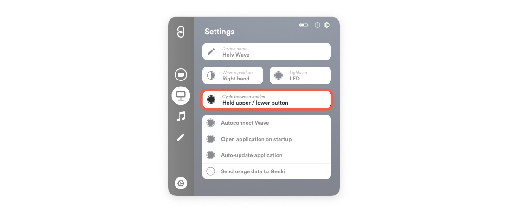

You can change between the modes: Video Call, Presentation, Music and Custom without opening the Wave for Work application.

In order to cycle modes:

- Hold the upper button on Wave to go to the previous mode.
- Hold the lower button on Wave to go to the next mode.

You can turn this feature on and off in the settings tab within the Wave for Work application.

