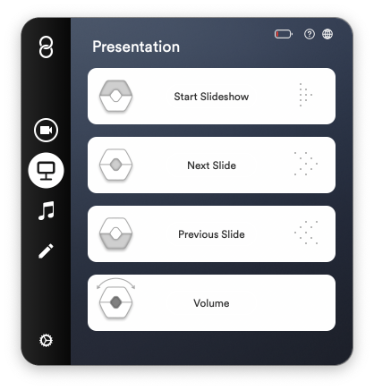
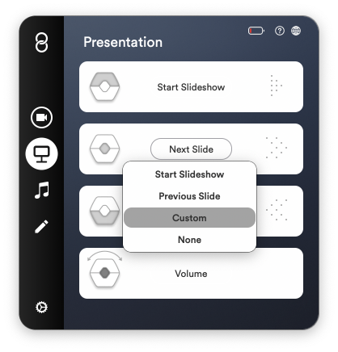
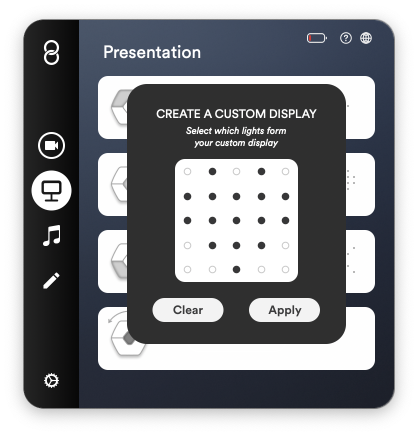

In the Presentation mode you can use Wave to change between slides. It works with your most used presentation applications such as Powerpoint and Keynote. You can also use this mode when sharing your screen in a video call, while presenting your work.

The middle button lets you change to the next slide while the lower button changes to the previous one. If you're presenting a video and need to raise the volume you can do so by holding the middle button while rotating your hand.

In order for Wave to control your presentation application you need to stay within the software you want it to control.

## Features

- Start Slideshow
- Navigate Slides
- Adjust Volume by holding middle button and rotating hand
- Customize each button with keyboard shortcuts

##### Supported applications

- Keynote and Preview on macOS
- Powerpoint on macOS and Windows 10
- Acrobat Reader on both macOS and Windows 10\*
- Other applications can be controlled by choosing "custom" and assigning keyboard shortcuts manually

## Customizing buttons

The default settings can easily be customized.

1. Click the action you want to change. For example "Next Slide".

 2. Select a new action from the list.

 3. To add a keyboard shortcut select "Custom". A pulsing button appears that reads "Press key". Type the keyboard shortcut on your keyboard you wish to use.

 4. To create a custom display for your keyboard shortcut click the heart icon to the right.

 5. Draw in a new icon that fits your keyboard shortcut by clicking the black and white dots with your mouse cursor. The black dots indicate the lights that will be visible. When finished click "Apply".

 6. You're all set!

In this example, every time you click the middle button, it now sends "cmd+G" to your computer, and when you do, Wave's display shows a "G" to indicate you've pressed the button.

