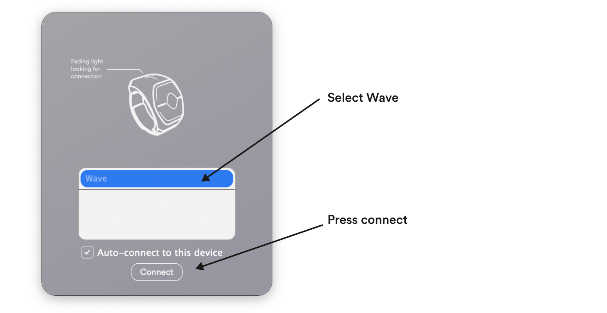

Follow the steps below to start using Wave for Work right away!

[ Download a pdf version of this quickstart guide here](/quickstart-guides/wave-for-work.pdf).

### Installation

1. Download the Wave for Work application to your computer.

import { LinkButton } from "@astrojs/starlight/components";

<LinkButton href="https://github.com/genkiinstruments/releases/releases/download/wave_for_work/Wave_for_Work_mac.zip">
  Download for macOS
</LinkButton>
<LinkButton
  href="https://github.com/genkiinstruments/releases/releases/download/wave_for_work/Wave_for_Work_win.exe"
  variant="secondary"
>
  {" "}
  Download for Windows{" "}
</LinkButton>

2. Install the application and open it.

3. Make sure Bluetooth is turned on in your computer.

4. Turn Wave on by pressing its middle button.

5. Select "Wave" in the Wave for Work application and press connect.

6. The application will now guide you through the necessary steps to start using Wave for Work right away!
